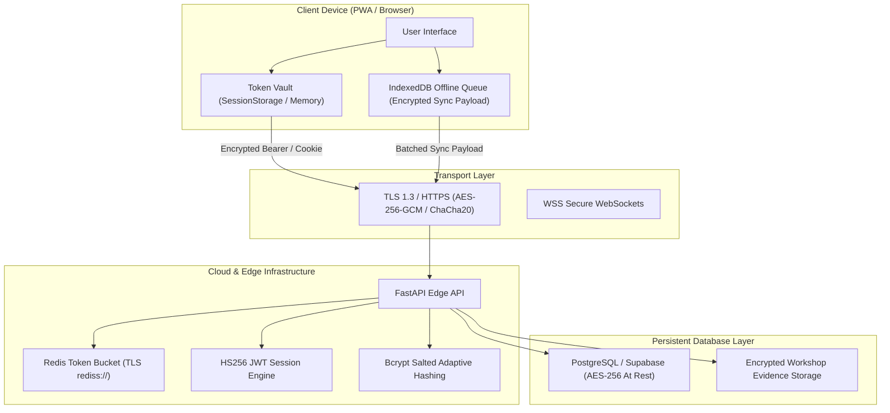

# Security & Encryption Architecture Policy

**Platform:** Empower / CyberLearn  
**Version:** 1.0  
**Scope:** Application Layer, Transport Layer, Client-Side Vaults, and Database Storage

---

## 1. Encryption Standards

---

## 2. Encryption in Transit

1. **Protocol Enforcement**:
   * All client-to-server communications require **TLS 1.3** (or TLS 1.2 minimum) with strict modern cipher suites (`AES-256-GCM`, `ChaCha20-Poly1305`).
   * Plain HTTP requests are permanently redirected to HTTPS with `Strict-Transport-Security` (HSTS) headers enabled (`max-age=31536000; includeSubDomains; preload`).
2. **Infrastructure Transport**:
   * Cache and message broker connections to Upstash Redis enforce native TLS wrapping (`rediss://`).
   * Database pooler connections enforce encrypted channels with validated certificate chains.

---

## 3. Cryptographic Password & Authentication Vaulting

1. **Password Hashing**:
   * Passwords are never stored in plaintext.
   * Credentials undergo **Bcrypt** adaptive salted hashing (`bcrypt.hashpw(password, gensalt())`) with calibrated work factors resistant to GPU-accelerated brute-force attacks.
2. **Session Token Architecture (`tokenVault.ts`)**:
   * Tokens are issued as signed JSON Web Tokens (`HS256`) with strict expiration windows (`ACCESS_TOKEN_EXPIRE_MINUTES`).
   * In production environments, session tokens are delivered via **`HttpOnly`**, **`SameSite=Lax`**, and **`Secure`** cookies, completely shielding them from malicious client scripts and XSS vulnerabilities.
   * Client-side session tracking uses scoped `sessionStorage` vaults rather than unpartitioned `localStorage`.
3. **Challenge-Response Verification Tokens**:
   * Password reset and email verification tokens use cryptographically random 256-bit entropy (`secrets.token_urlsafe(32)`).
   * Only SHA-256 digests (`hash_challenge_token()`) are stored on the database server, preventing token extraction in the event of database dumps.

---

## 4. Client-Side Offline Data Protection

1. **Local State & IndexedDB**:
   * Offline progress logs and queued submissions stored in client `IndexedDB` contain only learner IDs and completion hashes without sensitive credential exposure.
   * Exercise answer validations are verified using cryptographic SHA-256 answer hashes (`hashAnswer()`) rather than plaintext answer keys.
2. **Local Session Locking**:
   * If a session signature expires or authentication parameters change, the PWA client immediately locks active views (`lockSession()`) and redirects to re-authentication.

---

## 5. Encryption at Rest & Database Security

1. **Volume-Level Encryption**:
   * Production relational databases (PostgreSQL/Supabase) run on **AES-256** encrypted block storage volumes.
   * Backups are encrypted before object storage archiving.
2. **Secrets & Key Governance**:
   * Application secrets (`SECRET_KEY`, `ADMIN_STAFF_KEY`, DB passwords) are strictly injected via runtime environment variables and validated at boot (`assert_secure_settings()`).
   * Default or weak keys automatically abort production startup.
